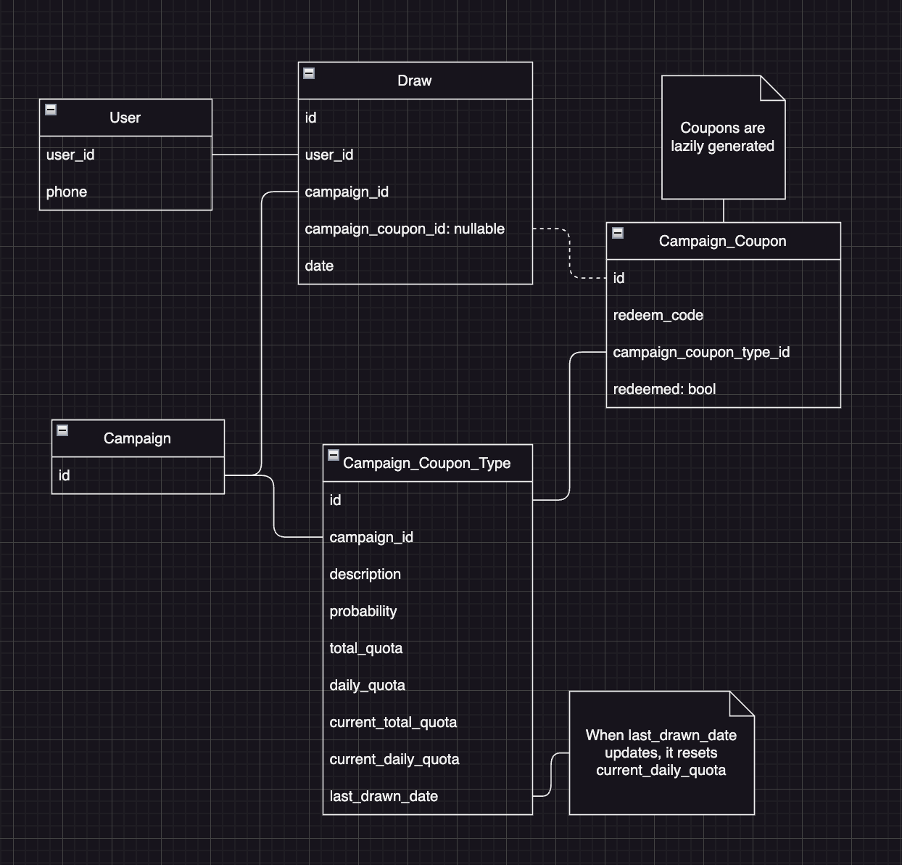

# Lucky Draw Web Service

Problem specification:
- Each customer can draw multiple times during the period of the campaign; however,
they are only allowed to draw one time each day
- Customer must fill in the mobile phone number for reference and SMS
- There are multiple categories of prizes, for example, $5 Cash Coupon, $2 Cash
Coupon, and Buy 1 get 1 free coupon. Each category, they have its total quota and
daily quota

## Architecture

**Database schema**



Details:
- A draw will only be assigned a `campaign_coupon_id` if the draw wins a coupon.
- A campaign can be created by sending a POST request to `/campaign` supply it with the list of coupon types to be created.
- Campaign coupons are lazily generated: a coupon is generated when a draw wins it.

## Design Decision

**DB schema design**

The `Campaign_Coupon_Type` table could have been further normalized but I have decided to keep it simple.

The relationship between `Campaign` and `Coupon_Type` could have been a many-to-many one but that would increase the complexity.

Scalability-wise, the table that would need the most scaling is `Draw`, and when it is reaching its capacity it can be partitioned/sharded.

**Caching**

The user might spam the `/draw` API so that a cache is a necesssity for reducing the DB load. The cache stores the mapping of users and the campaigns which they have enrolled in for the day, e.g.:

```
"user-1:enrolled-campaigns:2023-10-01": [
    "campaign-1",
    "campaign-2"
]
```

The cache will also cache the probability distributions of the campaign coupon types, e.g.:

```
"campaign-1-prob-dist": [
    "coupon-type-1:0.1",
    "coupon-type-2:0.2",
    "coupon-type-3:0.5",
]
```

The reason for this is to avoid having to read the probability distribution from the DB everytime a draw is issued. The server node then carry out the sampling to see if the draw has won any coupons. If so, the server then creates a transaction and do the following:

1. Decrement the quota of the `Campaign_Coupon_Type` entry. This operation would fail if the quota has already reached `0` (because of the constrait `quota > 0`). If the operation fails, the server would return a "no coupon" message to the user. Note that this is relying on the important assumption that: **once a particular coupon runs out of quota, the probability of winning other remaining coupons will stay unchanged**
2. Create a coupon entry in the `Campaign_Coupon` table and associate it to the `draw` entry, and return the information about the `coupon` to the user

In order to reset the `current_daily_quota` everyday, when the server tries to decrement the quote of the `Campaign_Coupon_Type` entry, it checks if the `last_drawn_date` is equal to the current date. If this isn't the case, `current_daily_quota` will be reset to the value of `daily_quota`. The SQL:

```sql
update campaign_coupon_types
set last_drawn_date = case
    when (last_drawn_date is null or last_drawn_date != CURRENT_DATE) then CURRENT_DATE
    else last_drawn_date
end,
current_daily_quota = case
    when (last_drawn_date is null or last_drawn_date != CURRENT_DATE) then daily_quota - 1
    else current_daily_quota - 1
end,
current_quota = current_quota - 1
where id = $1
returning *;
```

**Web server**

I chose to pair Rust with the `axum` web server framework. I have never tried this stack before so I want to challenge myself a bit. Also `axum` supports concurrent DB connections and comes with a connection pool OOTB.

**Database**

I have chosen to use a relational DB because the data entities can be naturally expressed by tables.

I opted for no ORMs because I worried that an ORM might not support all the necessary features the project needs from the DB, even though ORM can provide nice ergonomic features such as dynamic query building.

I picked the `sqlx` Rust library as the DB driver because it supports compile-time query checking . With compile-time query checking, I get to enjoy some of the benefits that are typically associated with ORMs - namely strong types.

## Setup

Prerequisites:
- `docker`

Run `docker compose up`

The swagger / redoc / rapidoc UI will be available at `localhost:8080/swagger-ui`, `localhost:8080/redoc`, and `localhost:8080/rapidoc` respectively

## Example

1. Create a user with POST `/user`
2. Create a campaign with POST `/campaign`
3. Draw with POST `/draw`
4. (If won,) Redeem with POST `/redeem`

## Future work

- Authentication & authorization policies
- Infra-as-code for deployment, k8s, etc.
